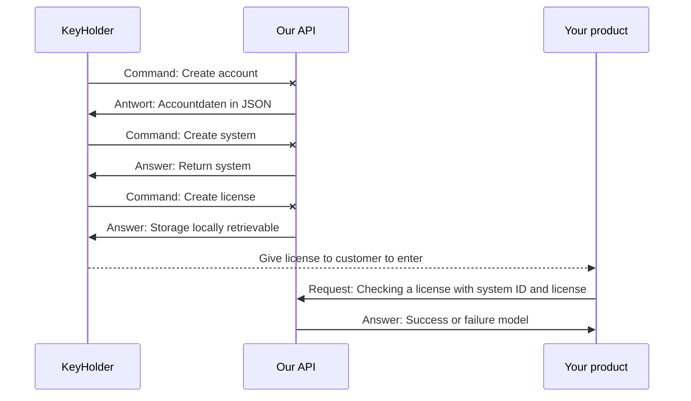

# KeyHolderLicenceApiExamples
Here you will find concrete application examples for the KeyHolder and the HenryMilesLicenceAPI.

> In the near future, programs will be available here that clearly
> explain the use of the API and the KeyHolder. It's easier than you
> think.

## Create and check a license
