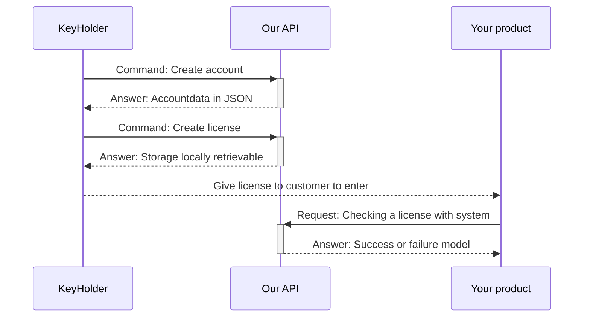

# KeyHolderLicenceApiExamples
Here you will find concrete application examples for the KeyHolder and the HenryMilesLicenceAPI.

> In the near future, programs will be available here that clearly
> explain the use of the API and the KeyHolder. It's easier than you
> think.

## What is licence.influencers-hub.de?
It is the API that is still free and with which it is possible to create systems under one account and licenses under these systems. The detailed Postman documentation, at https://documenter.getpostman.com/view/30780674/2s9YeN3pAF, shows the use of all endpoints in many languages.

You can now build software that uses this API as you wish and thus actively prevent software piracy, but you could also build verification codes for e-mail verification, for example. There are one-time licenses for this, which become invalid the first time they are used. The possibilities are endless.

Let off steam!

## What is the HenryMilesLicenceApi nuget?
It is a Microsoft nuget from .NET6 (tested and released up to .NET7, .NET8) that makes it very easy for developers to implement the "https://licence.influencers-hub.de" API in their .NET products without having to think twice.

The dependencies are very low and with 3 lines of code you can perform the test on the API with one system and one license.

## What is KeyHolder?
KeyHolder is a desktop program under .NET with which it is possible to manage the licenses and system on the "https://licence.influencers-hub.de" API without having any programming knowledge.

It is not essential for the API, unless you want to create offline licenses. This is not possible via the API and the "HenryMilesLicenceApi" Nuget.

## Kosten Offline-Lizenzen etwas?
Simply put, yes. But we need to go into a little more detail. The API and the nuget are completely free and offer no hidden traps.

These are always license checks that work online and only with an active and free Internet connection.

This is different for offline licenses. Neither you nor your customer need an active Internet connection. You create a license on your system. You integrate the .NET nuget into your product and can include an offline check of the license. Furthermore, you then pass the created license on to your customer, and they can use it directly.

All you need to do is purchase the KeyHolder. Further language support, apart from .NET, is planned. But since the offline licenses are also RSA token-based, you can also implement your own solutions and keep track of everything with KeyHolder.

## Ist das eine Datenkrake?
No! Apart from the typical security logs of the server on which the API runs, no data is collected. Currently, no telemetry data either. If we were to do this, we would obtain your permission in a clear form beforehand.

Even if you can determine with one-time licenses that they have been checked at least once at the API, you do not know from which program or location.

Data protection and compliance with the law are very important to us.

## Generating and checking a license, generally not under .NET
